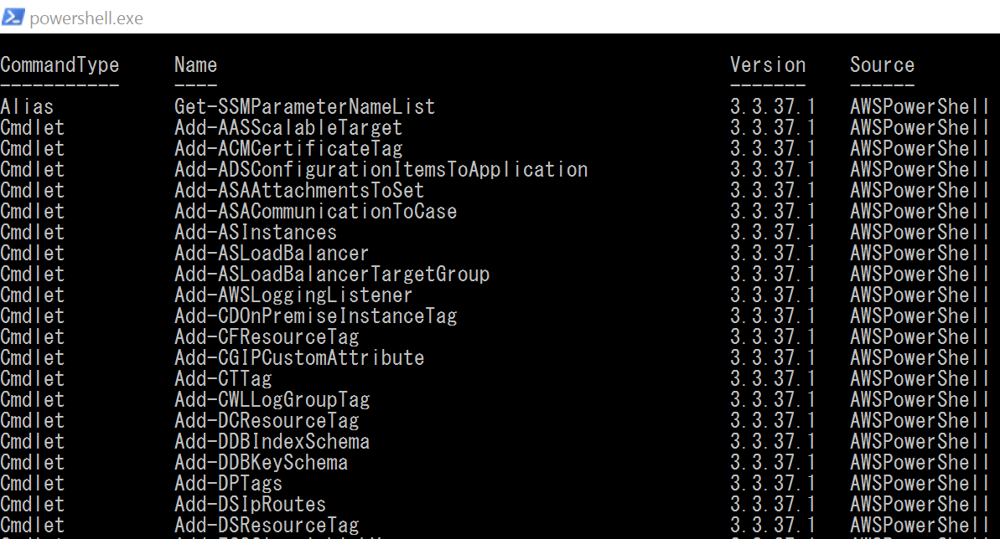
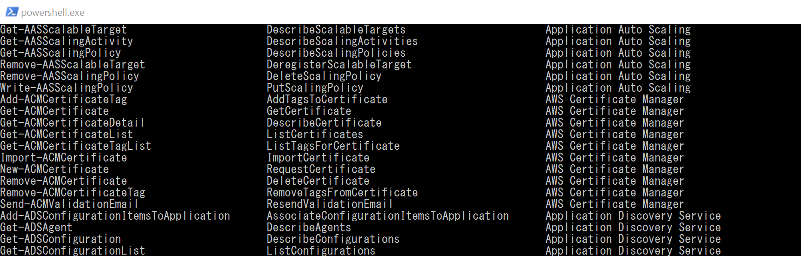
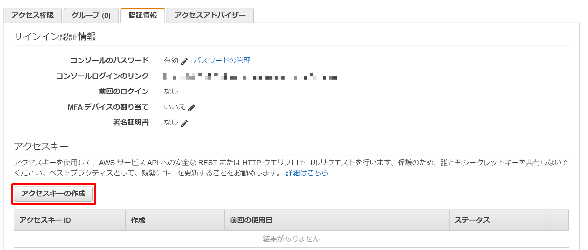
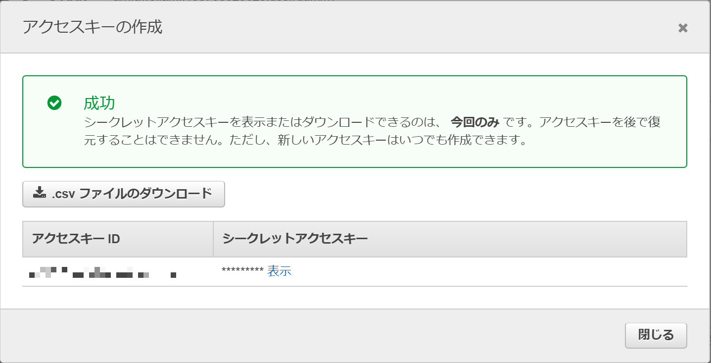
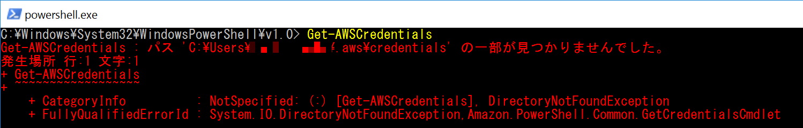
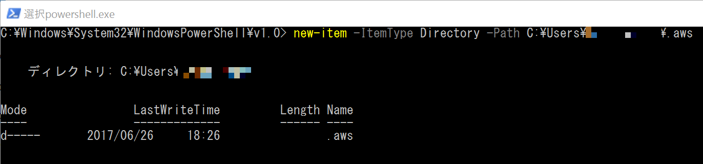
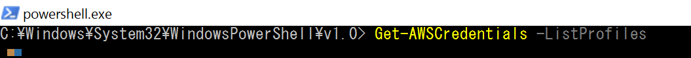

# 🔰AWS Tools for Windows PowerShellを触ってみる

## 🔰AWS Tools for Windows PowerShell のドキュメント

公式のドキュメントは

[https://aws.amazon.com/jp/documentation/powershell/](https://aws.amazon.com/jp/documentation/powershell/)

にあるのでここをみればOK

## 🔰AWS Tools for Windows PowerShell　のインストール

- [AWS Tools for Windows](https://aws.amazon.com/jp/powershell/)からダウンロードしてインストール
- [PowerShell Gallery](https://www.powershellgallery.com/packages/AWSPowerShell/)でインストール
- [chocolatey](https://chocolatey.org/)でインストール

上記のお好きな方法でインストールして下さい。

※PowerShell Galleryはマイクロソフトが提供する統合リポジトリ。Powershell v5以上で利用できる。
[PSGallery - AWSPowershell](https://www.powershellgallery.com/packages/AWSPowerShell/)

下記のようなPSコマンドでインストール出来る。

```powershell
#インストールコマンド
Install-Module -Name AWSPowerShell

#アップデートコマンド(アップデート出来るのはPowerShell Galleryでインストールした場合のみ)
update-module -Name AWSPowerShell
```

[chocolatey](https://chocolatey.org/)はWindowsで利用できるパッケージ管理ソフト

## 🔰インストールされたモジュールの確認

```powershell
#Get-ModuleのListAvailableで利用できるモジュール取得
Get-Module AWSPowerShell -ListAvailable
```


## 🔰モジュールのバージョン確認

```powershell
#バージョンの表示
Get-AWSPowerShellVersion
```


## 🔰利用できるコマンドの一覧

```powershell
Get-Command -Module AWSPowerShell
```



## 🔰利用できるAWSサービス一覧を呼び出すコマンド

```powershell
Get-AWSCmdletName
```



## 🔰AWS Credentialsを取得

AWS環境に接続するのに使用する認証情報を生成する。

IAMコンソールから下記のように生成できる。
アクセスキーはセキュリティ等色々とあるので考慮して注意して利用すべし。

取扱注意！

[Best Practices for Managing AWS Access Keys](http://docs.aws.amazon.com/general/latest/gr/aws-access-keys-best-practices.html)





## 🔰AWS環境へ接続設定(デフォルト設定)

さきほど生成したアクセスキーとシークレットキーを指定する。

```powershell
Initialize-AWSDefaults -AccessKey アクセスキー -SecretKey シークレットキー -Region ap-northeast-1
```

これでデフォルトで接続する設定は完了。
あとはAWSのサービスを叩くコマンドを実行する。

```powershell
Get-EC2Instance
```

とかやるとデフォルト設定で指定したアクセスキー・シークレットキー・リージョンのEC2インスタンスの一覧を取得出来る。

デフォルト設定をクリアする場合は

```powershell
Clear-AWSDefaults
```

## 🔰AWSCredentialsを利用して接続する

複数環境を利用したりする場合に。
毎回Initialize-AWSDefaultsを切り替える方法もあるが。
credentialをAWS SDK Storeに登録して、それを指定する方歩もある。

```powershell
Set-AWSCredentials -StoreAs プロファイル名 -AccessKey アクセスキー -SecretKey シークレットキー
```

と設定してやるとAWScredentialsがAWS SDK Storeに登録出来る。

`C:\Users\<username>\AppData\Local\RegisteredAccounts.json`

```powershell
Get-AWSCredentials -ListProfiles
```

で設定したクレデンシャルが取得できるはずだが。
何故か下名の環境だとエラー



調べたらなんか同じこといってる人がいる。

[Get-AWSCredentials -ListProfiles fails after recent update](https://forums.aws.amazon.com/thread.jspa?threadID=245530)

.awsフォルダを作成すればエラーが回避できると書いてあるので本当？　と思いながら試して見る。

Powershellのnew-itemでユーザフォルダの下に.awsフォルダを作成。



Get-AWSCredentials -ListProfiles実行



なんか動いた。

Get-AWSCredentialsだとAWS SDK Store以外にも資格情報ファイル(.aws)のフォルダを読みにくけれどフォルダが存在しなくてエラーと言っている感じ？

ともかくAWSSDKStoreに格納した情報を利用してコマンドを実行するには下記のように行う

```powershell
#EC2インスタンス取得
Get-EC2Instance -ProfileName プロファイル名 -Region ap-northeast-1
```

もしくは

```powershell
#プロセス中使う資格情報をセットして
Set-AWSCredentials -ProfileName プロファイル名
#EC2インスタンス取得
Get-EC2Instance -Region ap-northeast-1
```

## 資格情報

AWS Tools for Windows PowerShellで利用できる資格情報は、

- AWS SDK Store `C:\Users\<username>\AppData\Local\RegisteredAccounts.json`
- 資格情報ファイル  `C:\Users\username\.aws\credentials`

検索順序は下記参照

[Credentials Search Order](http://docs.aws.amazon.com/ja_jp/powershell/latest/userguide/specifying-your-aws-credentials.html)

今回の例で利用しているのはAWS SDK Storeの方。

## 🔰$AWSHistory

$AWSHistoryは特殊な変数で。
AWSコマンドレットの呼び出しと、それにより受け取るオブジェクトを保持しています。
他にも実行時間等のデータも含まれていたりする。

保持する履歴の最大数はSet-AWSHistoryConfigurationで設定できる。


以上
