# 🔰AWS Tools for Windows PowerShellをさわってみる

AWSサービスとリソースをWindows Powershellから利用するためにAWSよりリリースされているAWS Tools for Windows PowerShellをさわってみる。

本記事でさわるのは **Windows Powershell** 用です。**Powershell Core** 用は下記リンクのようにまた別に存在しています。

↓PowershellCore用のモジュール。  
[AWSPowerShell.NetCore](https://www.powershellgallery.com/packages/AWSPowerShell.NetCore/3.3.313.0)

## 🔰AWS Tools for Windows PowerShellのドキュメント

[AWS Tools for Windows PowerShell のドキュメント](https://aws.amazon.com/jp/documentation/powershell/)にあるのでここをみればOK

## 🔰AWS Tools for Windows PowerShellのインストール

- [AWS Tools for Windows](https://aws.amazon.com/jp/powershell/)からインストーラをダウンロードしてインストール
- [PowerShell Gallery](https://www.powershellgallery.com/packages/AWSPowerShell/)でインストール
- [chocolatey](https://chocolatey.org/)でインストール

上記のお好きな方法でインストールして下さい。

※PowerShell Galleryはマイクロソフトが提供する統合リポジトリ。Powershell v5以上で利用できる。
[PSGallery - AWSPowershell](https://www.powershellgallery.com/packages/AWSPowerShell/)

下記のようなコマンドレットでインストール出来る。

```powershell
#インストール
Install-Module -Name AWSPowerShell

#アップデート(アップデート出来るのはPowerShell Galleryでインストールした場合のみ)
Update-Module -Name AWSPowerShell
```

[chocolatey](https://chocolatey.org/)はWindowsで利用できるパッケージ管理ソフト

## 🔰インストールされたモジュールの確認

```powershell
#Get-ModuleのListAvailableで利用できるモジュール取得
Get-Module AWSPowerShell -ListAvailable
```

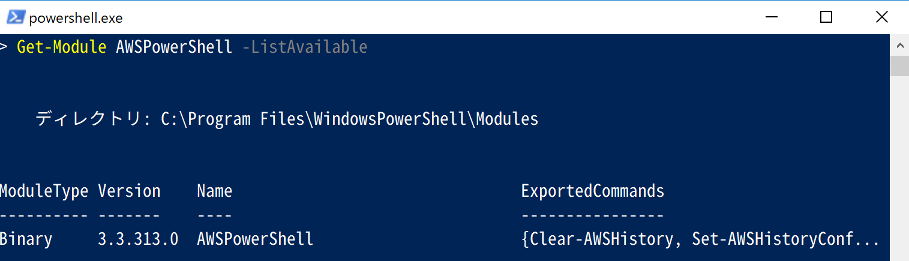

※余談

msiのインストーラでインストールすると`C:\Program Files (x86)\AWS Tools\Powershell`にインストールされるみたいです。
そしてインストーラが環境変数のPSModulePathに上記のディレクトリを追加してインストールディレクトリへのパスが通る模様。

## 🔰モジュールの読込

Powershell v3.0以降ならば、パスが通っているのでコマンドレット実行時に暗黙的にモジュールの読込を行います。

明示的にモジュールの読込を行う場合は下記を実行。

```powershell
# import-moduleでモジュールのインポート
Import-Module AWSPowerShell
```

## 🔰モジュールのバージョン確認

`Get-AWSPowerShellVersion`コマンドレットでバージョンの確認をしています。

[aws document - Get-AWSPowerShellVersion Cmdlet](https://docs.aws.amazon.com/powershell/latest/reference/index.html?page=Get-AWSPowerShellVersion.html&tocid=Get-AWSPowerShellVersion)

```powershell
# Get-AWSPowerShellVersionでバージョンの確認
Get-AWSPowerShellVersion
```

Version 3.3.313.0がインストールされている事がわかります。

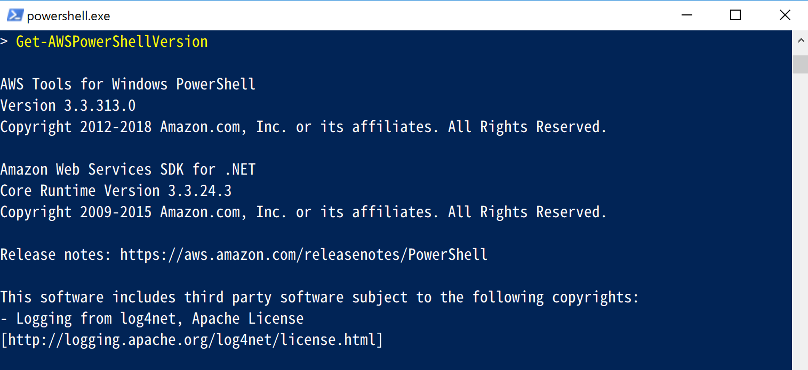

## 🔰利用できるコマンドレットの一覧

AWSPowerShellモジュールで用意されているコマンドレットの一覧を取得してみます。

```powershell
# Get-Commandのmodule引数でモジュールで利用できるコマンドレットを取得
Get-Command -Module AWSPowerShell
```

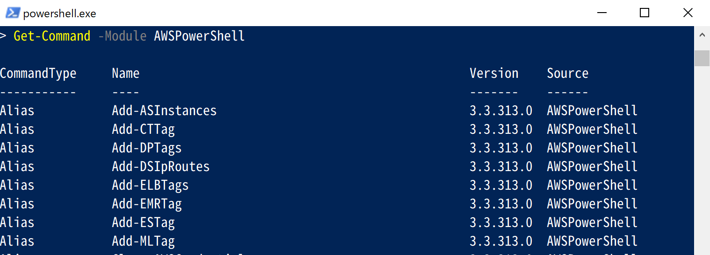

## 🔰利用できるAWSサービス一覧を呼び出す

`Get-AWSCmdletName`でコマンドレットがどのサービスを操作する物なのか紐づけられた一覧が取得できます。

[aws document - Get-AWSCmdletName Cmdlet](https://docs.aws.amazon.com/powershell/latest/reference/index.html?page=Get-AWSCmdletName.html&tocid=Get-AWSCmdletName)

S3のサービスを操作するコマンドレットの一覧がほしい！　みたいな場合はここから抽出すれば便利です。

```powershell
# Get-AWSCmdletNameでサービスとコマンドレットの紐づけ一覧を取得してformat-tableで整形して表示
Get-AWSCmdletName | FT *
```

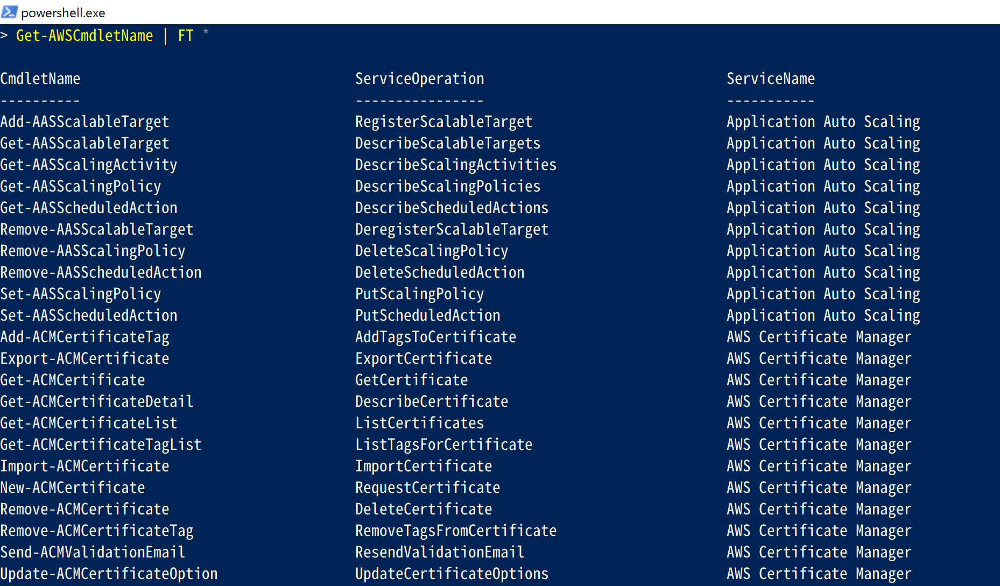

## 🔰AWSマネジメントコンソールでアクセスキーとシークレットキーを取得

AWS環境に接続するのに使用するための認証情報を生成してみます。

認証情報はAWSマネジメントコンソールのIAMから下記のような手順で生成できる。
アクセスキーはセキュリティ等色々とあるので考慮して注意して利用すべし。

取扱注意！

[Best Practices for Managing AWS Access Keys](http://docs.aws.amazon.com/general/latest/gr/aws-access-keys-best-practices.html)

IAMユーザを選択してアクセスキーの作成  


アクセスキーのダウンロード  
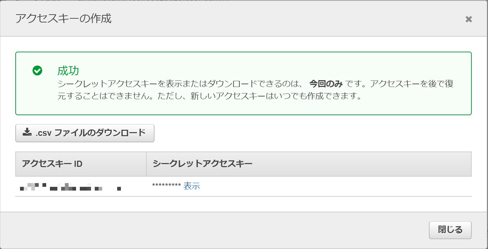

アクセスキーをダウンロードでできるのは一度だけなので注意。

※アクセス権限等は各自適切に行なって下さい。

## 🔰EC2-Instanceの一覧を取得してみる

`Get-EC2Instance`でEC2インスタンスの一覧が取得できる。
アクスキーとシックレットキーは先程取得した物を利用します。

[aws document - Get-EC2Instance Cmdlet](https://docs.aws.amazon.com/powershell/latest/reference/index.html?page=Get-EC2Instance.html&tocid=Get-EC2Instance)

```Powershell
# Get-EC2Instanceで東京リージョン(ap-northeast-1)のインスタンス一覧を取得
Get-EC2Instance -AccessKey アクセスキー -SecretKey シークレットキー -Region ap-northeast-1

```

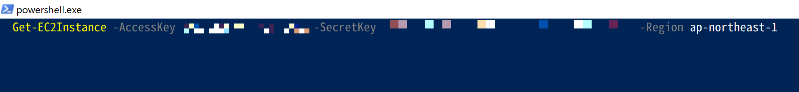

## 🔰AWS環境へ接続設定(デフォルト設定)

接続先を指定するのにアクセスキーとシークレットキーを毎回入力する他にデフォルト設定も用意されています。

さきほど生成したアクセスキーとシークレットキーをデフォルト設定に指定する。

```powershell
Initialize-AWSDefaults -AccessKey アクセスキー -SecretKey シークレットキー -Region ap-northeast-1
```

これでデフォルトで接続する設定は完了。
あとはAWSのサービスを叩くコマンドレットを実行する。

試しにEC2インスタンスの一覧を取得してみる。

```powershell
# Get-EC2Instanceを実行（デフォルトに設定されたアクセスキーやリージョン情報を利用します）
Get-EC2Instance
```

このようにデフォルト設定を設定すると指定したアクセスキー・シークレットキー・リージョンのEC2インスタンスの一覧を取得出来る。

デフォルト設定をクリアする場合は

```powershell
Clear-AWSDefaults
```

なおこのアクセスキーとシークレットキーはどこに登録されるかというと、下記パスのjsonファイルに暗号化して保存されるようです。(AWS SDK Store)

`C:\Users\<ユーザ名>\AppData\Local\AWSToolkit\RegisteredAccounts.json`

このAWS Powershellで利用されるこのjsonファイルは **.NET 認証情報ファイル** と呼ばれており、AWS CLIで利用する **共有認証情報ファイル** は別物ものになります。

.NET SDK認証は暗号化する際に、ログインユーザのプロファイルを利用するようなので、認証情報を登録したユーザと別ユーザと共有するというような利用方法はできません。

一つの認証情報を記載したファイルを複数のユーザで共有して利用したいという要件がある場合は、共有認証情報ファイルを利用します。

共有認証情報ファイルに対してデフォルト設定を行いたい場合は、`ProfileLocation`引数に共有認証情報ファイルのパスを指定してコマンドレットを実行すると指定したパスに共有認証情報ファイルの形式で書込を行います。

各コマンドレットを実行する際には、ProfileLocationで読み込む認証情報のファイルパスを指定してあげればよいです。

```Powershell
Get-S3Bucket -ProfileName プロファイル名 -ProfileLocation 認証情報のパス
```

ただ共有認証情報ファイルは暗号化せずに平文で情報を持つのでファイル管理はより慎重に行って下さい。

## 🔰Set-AWSCredentialでprofileを登録してみる

複数環境を切り替えながら利用する場合。
毎回`Initialize-AWSDefaults`を切り替える方法もあるが。

それだと大変なので資格情報をAWS SDK Storeに登録し、コマンドレット実行時に資格情報を指定する方法もある。

```powershell
Set-AWSCredentials -StoreAs プロファイル名 -AccessKey アクセスキー -SecretKey シークレットキー
```

デフォルトでは下記のファイルに資格情報が追加されます。
`C:\Users\<username>\AppData\Local\AWSToolkit\RegisteredAccounts.json`

[](https://docs.aws.amazon.com/powershell/latest/reference/index.html?page=Set-AWSCredential.html&tocid=Set-AWSCredential)

## 🔰Get-AWSCredentialで登録されているプロファイルを確認してみる

`Get-AWSCredentials`コマンドレットに`ListProfileDetail`引数をつけて実行すると登録されている資格情報の一覧が取得できます。
`Get-AWSCredentials`コマンドレットには`ListProfile`という似たような事を行う引数もありますが、こちらは現在利用しているVersion 3.3.313.0で実行すると廃止予定と警告が出ているので利用しないでおきましょう。（機能もListProfileDetailのほうがいいですし）

Version 3.3.313.0でListProfileは警告メッセージが表示される  
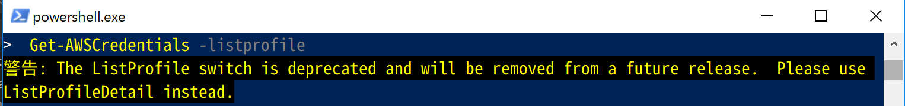

```Powershell
# Get-AWSCredentialsにListProfileDetailをつけて資格情報の一覧を取得
Get-AWSCredentials -ListProfileDetail
```

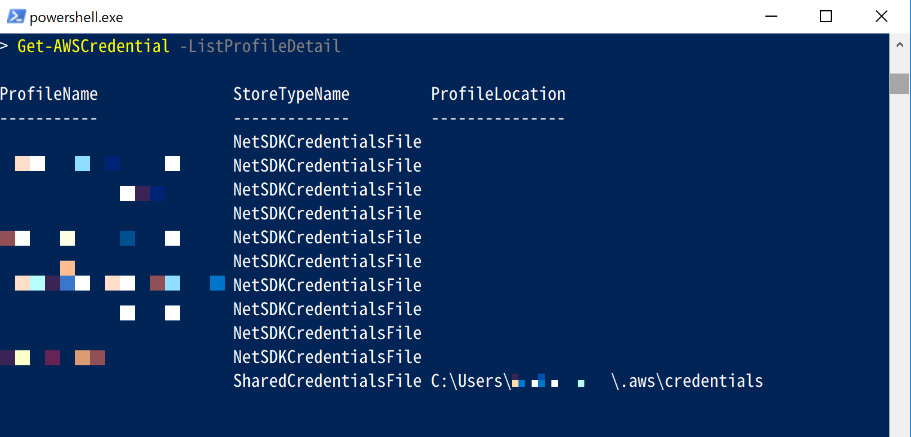

上記のように資格情報の一覧が取得できます。

なおStoreTypeNameをみれば資格情報が何から読み込まれたのかわかります。

- NetSDKCredentialsFile(.NET 認証情報)
- SharedCredentialsFile(共有認証情報)

## 🔰AWS SDK Storeに登録した資格情報でコマンドレットを実行してみる

AWS SDK Storeに登録した資格情報を用いてコマンドレットを実行するには`ProfileName`に設定したプロファイル名を渡して実行してあげればよい。

```powershell
# EC2インスタンス取得
Get-EC2Instance -ProfileName プロファイル名 -Region ap-northeast-1
```

毎回コマンドレット実行時にProfileNameを指定してもいいですが。
下記のように`Set-AWSCredentials`に`ProfileName`を指定するとプロセス中使用する資格情報を指定できたりもします。

```powershell
# プロセス中使う資格情報をセットして
Set-AWSCredentials -ProfileName プロファイル名
# 指定されたプロファイルのEC2インスタンス取得
Get-EC2Instance -Region ap-northeast-1
```

## 🔰プロファイル情報を確認したい場合

`Set-AWSCredentiald`で資格情報を暗号化して登録した後に、復号化してアクセスキーとシークレットキーを確認したい場合。

`Get-AWSCredential -ProfileName プロファイル名`のようにコマンドレットを実行するとAmazon.Runtime.BasicAWSCredentialsなるオブジェクトが返ってくるようになります。(デフォルトが取得した時は引数なしで実行)

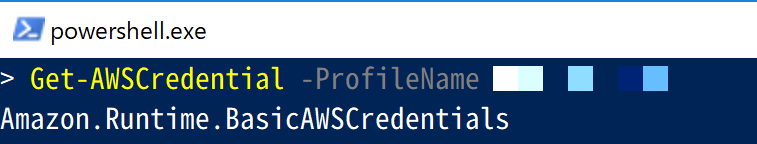

Amazon.Runtime.BasicAWSCredentialsを`Get-Member`でどんな物か確認してみると`GetCredentials`というメソッドがある事がわかります。

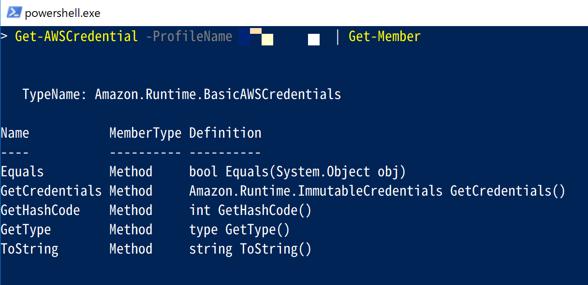

試しにこのメソッドを実行してみます。

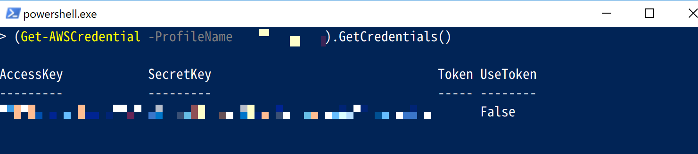

資格情報が表示されました。

BasicAWSCredentialsについて、もっと知りたい場合は下記のようなドキュメントがあります。

[AWS SDK for .NET Documentation - BasicAWSCredentials Class](https://docs.aws.amazon.com/sdkfornet1/latest/apidocs/html/T_Amazon_Runtime_BasicAWSCredentials.htm)

※余談

別ユーザで作成したtestという認証情報を、AWSSDKStoreに突っ込んで復号化してみようとした場合。

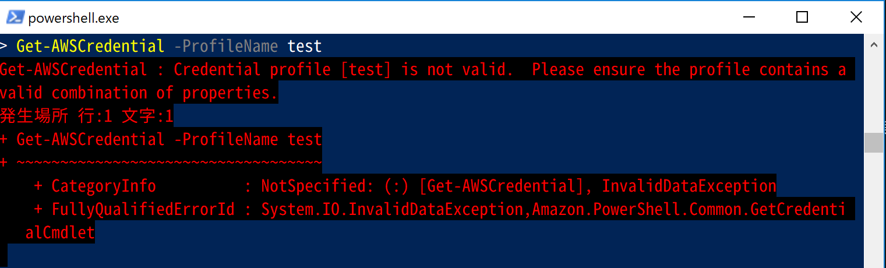

## 🔰資格情報の読込順序

AWS Tools for Windows PowerShellで利用できる資格情報は色々と種類がありましたが、資格情報を検索する順番については下記に資料があります。

[認証情報の検索順序](https://docs.aws.amazon.com/ja_jp/powershell/latest/userguide/specifying-your-aws-credentials.html#pstools-cred-provider-chain)

ただ、一つの環境に同名のプロファイル名をいっぱい用意しているとかでは無い限りそこまで気にする必要もないのかなとは思いますが。

## 🔰$AWSHistory

`$AWSHistory`は特殊な変数で。
AWSコマンドレットの呼び出しと、それにより受け取るオブジェクトを保持しています。
他にも実行時間等のデータも含まれていたりする。

保持する履歴の最大数はSet-AWSHistoryConfigurationで設定できる。  

```Powershell
# 変数$AWSHistoryを表示
$AWSHistory
```

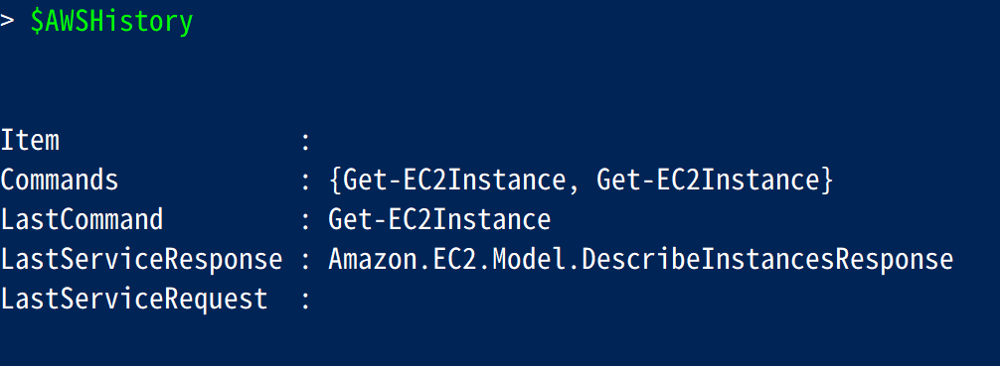

以上
